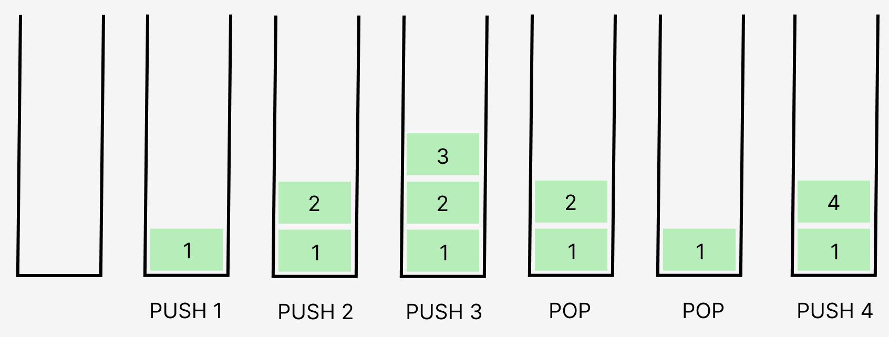

# Stack(스택)

## Stack이란?
- **후입선출(LIFO: Last In First Out)** 구조
    -> 나중에 들어가는 원소가 가장 먼저 나오는 형태이다.
- 단방향 구조
    -> 데이터의 추가와 제거가 모두 스택의 맨 위에서 일어난다.

### Stack의 연산
- **PUSH** 연산: 데이터를 스택의 맨 위에 추가한다.
- **POP** 연산: 스택의 맨 위 데이터를 제거한다.


### Stack의 예 - 접시 쌓기

쌓여 있는 접시 사이에서 한 번에 중간에 있는 접시를 꺼낼 수는 없다.<br>
가장 위에 쌓인 접시부터 하나씩 꺼내야 한다.<br>
접시를 추가할 때도 중간에 끼워 넣을 수는 없다.<br>
가장 위에 차곡 차곡 쌓아 올려야 한다.<br>
위쪽에 위치한 접시일수록 최근에 쌓은 것, 아래쪽에 위치한 접시일수록 오래 전에 쌓은 것이다.

## Java Stack
### Stack 객체 생성
```
import java.util.Stack;
Stack<Element> stack = new Stack<>();

Stack<Integer> stack1 = new Stack<>(); // Integer 타입의 스택 생성
Stack<String> stack2 = new Stack<>(); String 타입의 스택 생성
```
### 주요 메서드
1. ```push(E item)```
스택의 맨 위에 **데이터를 추가**하고, 추가된 데이터를 반환한다.
2. ```pop()```
스택의 맨 위 **데이터를 제거**하고, 제거된 데이터를 반환한다.
스택이 비어 있으면 EmptyStackException을 발생시킨다.
3. ```peek()```
스택의 맨 위 데이터를 **제거하지 않고 반환**한다.
스택이 비어 있으면 EmptyStackException을 발생시킨다.
4. ```clear()```
스택에 저장되어 있는 모든 값을 제거한다.
5. ```isEmpty()```
스택이 비어 있는지 확인한다. 스택이 비어 있으면 true, 비어 있지 않으면 false를 반환한다.
6. ```size()```
스택의 크기를 반환한다.
7. ```contains(Object o)```
스택에 o가 있는지 확인한다. o가 있으면 true, 없으면 false를 반환한다.

### 사용 예시
```
import java.util.Stack;
Stack<Integer> stack = new Stack<>();
 
stack.push(1);
stack.push(2);
stack.push(3);
stack.push(4);

System.out.println(stack.peek()); // 4
System.out.println(stack.pop()); // 4
System.out.println(stack.pop()); // 3

System.out.println(stack.size()); // 2
System.out.println(stack.contains(1)) // true
```

## 연습 문제
1. [BOJ 9012 괄호](https://www.acmicpc.net/problem/9012) (실버 4)
2. [BOJ 10773 제로](https://www.acmicpc.net/problem/10773) (실버 4)
3. [BOJ 17413 단어 뒤집기 2](https://www.acmicpc.net/problem/17413) (실버 3)
4. [BOJ 10799 쇠막대기](https://www.acmicpc.net/problem/10799) (실버 2)
5. [BOJ 2493 탑](https://www.acmicpc.net/problem/2493) (골드 5)